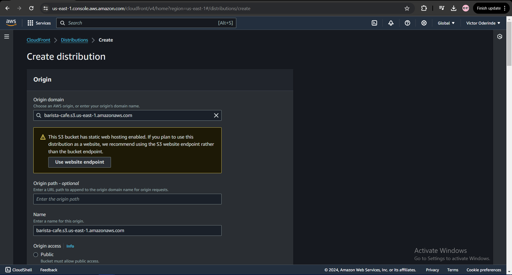
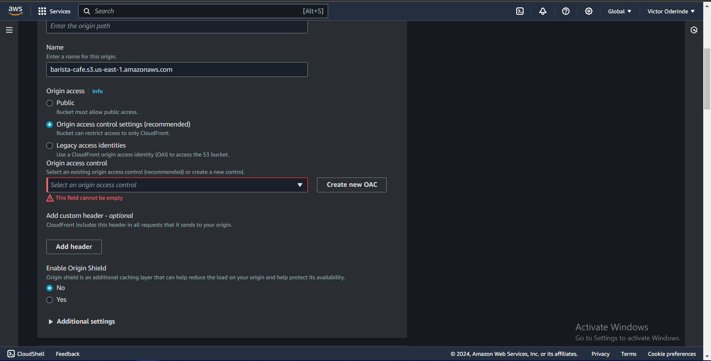
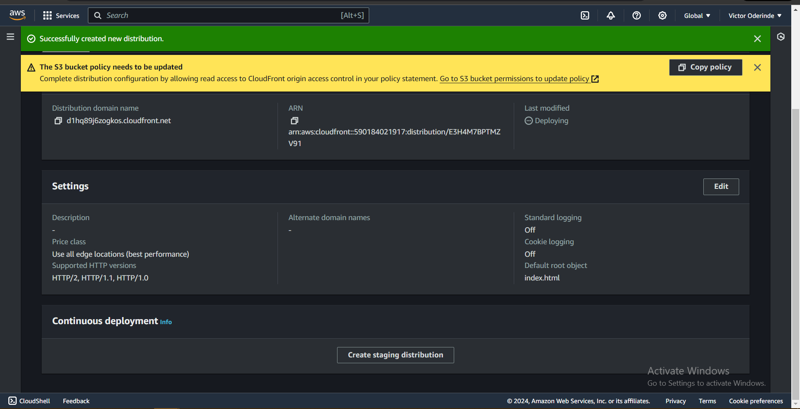
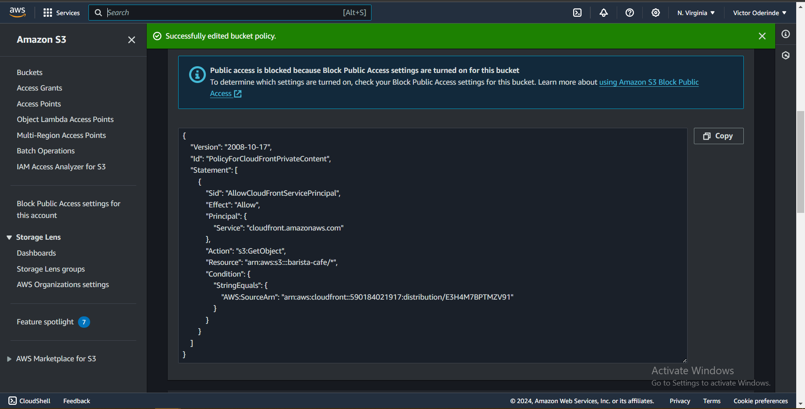
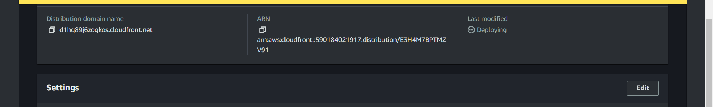
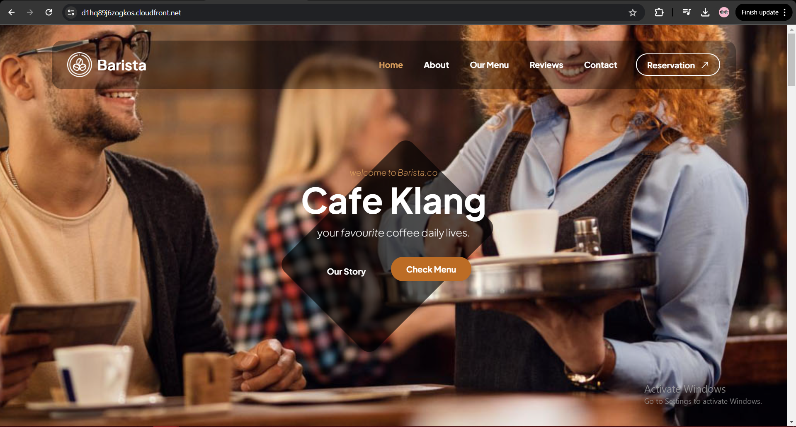

# This is a mini-project to deploy a Static Website using AWS S3 Bucket and CloudFront

In this mini-project, I hosted a static website using AWS S3 Bucket for storage and CloudFront for content delivery.

## STEPS

### Created S3 bucket

### Uploaded the static website files

### Created a Distribution with CloudFront

### Created OAC - Origin Access Control - to restrict access to public

### Added policy to make it public

### Finally, confirm website with distribution domain name

- copy the domain name link and open in a new browser tab
  
  

### For Static Template

- Get your Static Website for free from [Tooplate](https://www.tooplate.com/free-templates)

## END
