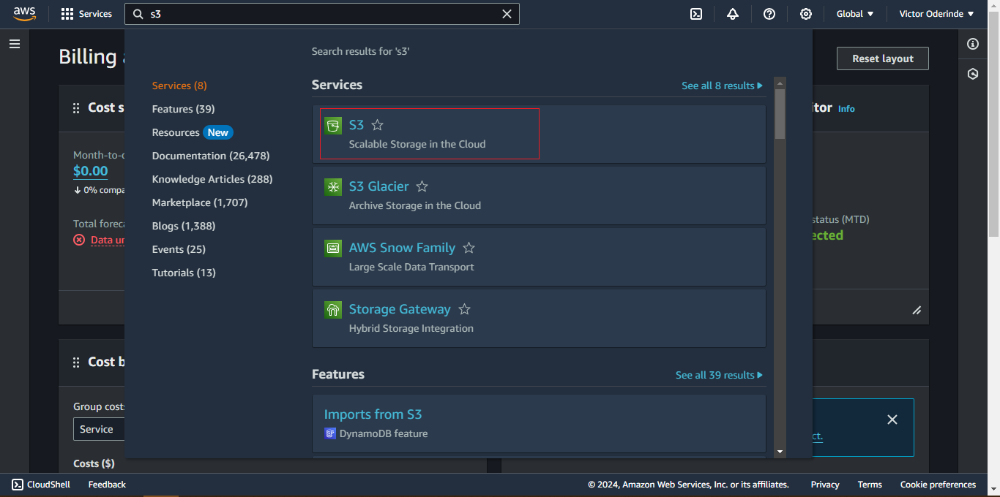
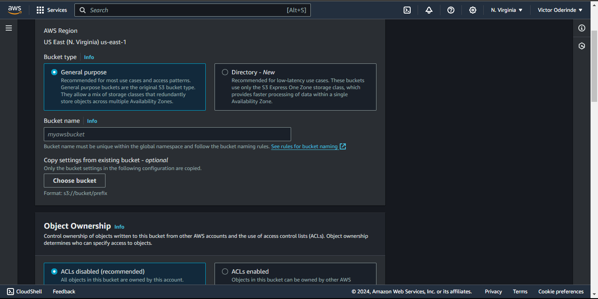
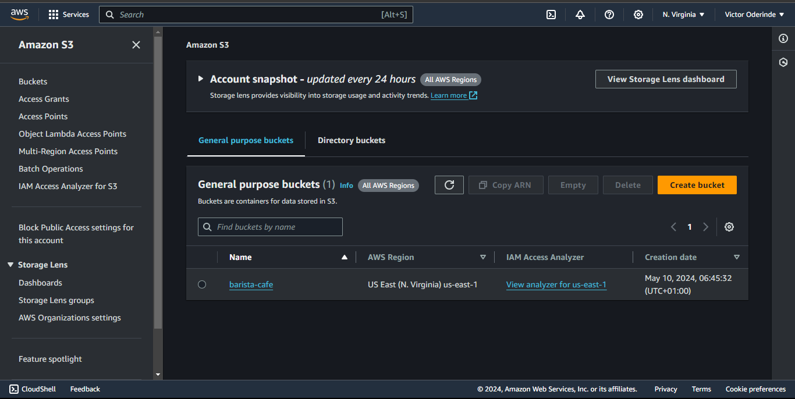
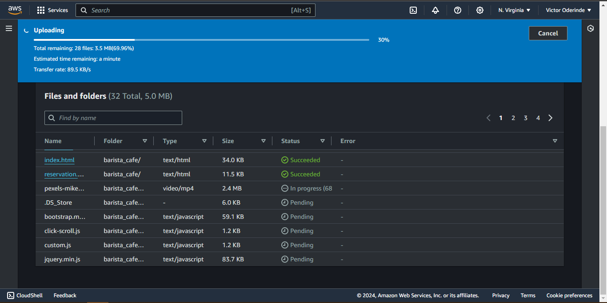
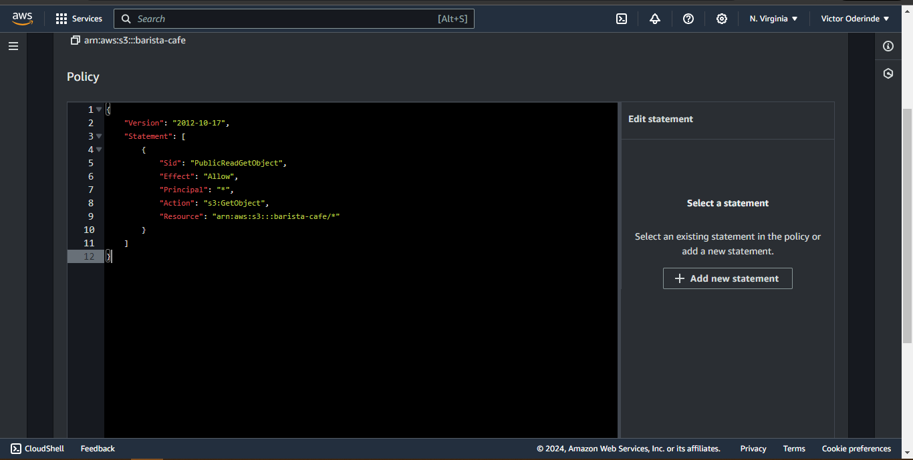
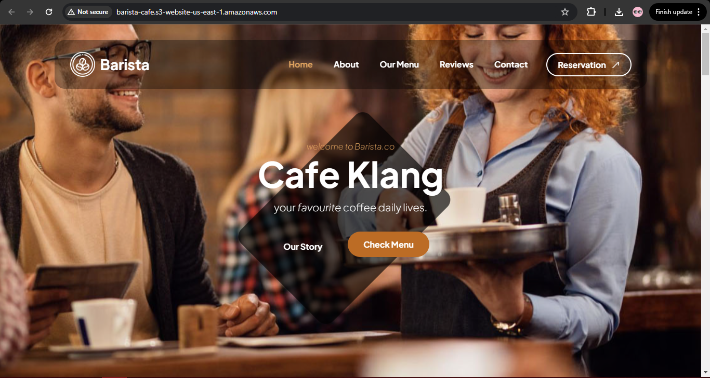
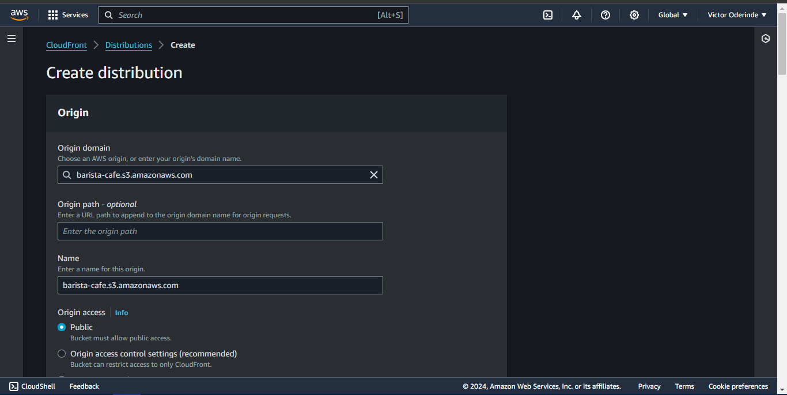
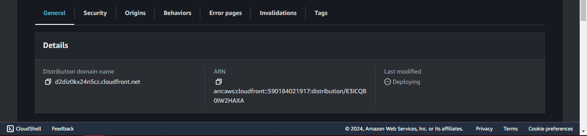
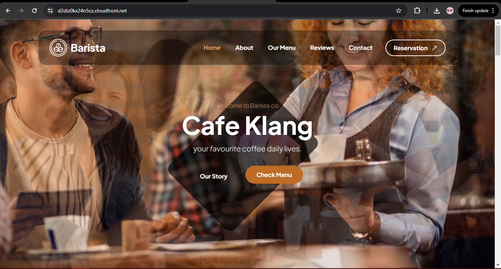

# This is a mini-project to deploy a Static Website using AWS S3 Bucket and CloudFront

In this mini-project, I hosted a static website using AWS S3 Bucket for storage and CloudFront for content delivery.

## STEPS

### Created S3 bucket

### Uploaded the static website files

### Added policy to make it public

### View of my static web from the end-point URL

- _bucket-name>properties>static website hosting_

### Create distribution with Cloudfront

### Finally, confirm website with distribution domain name

### For Static Template

- Get your Static Website for free from [Tooplate](https://www.tooplate.com/free-templates)

## END
